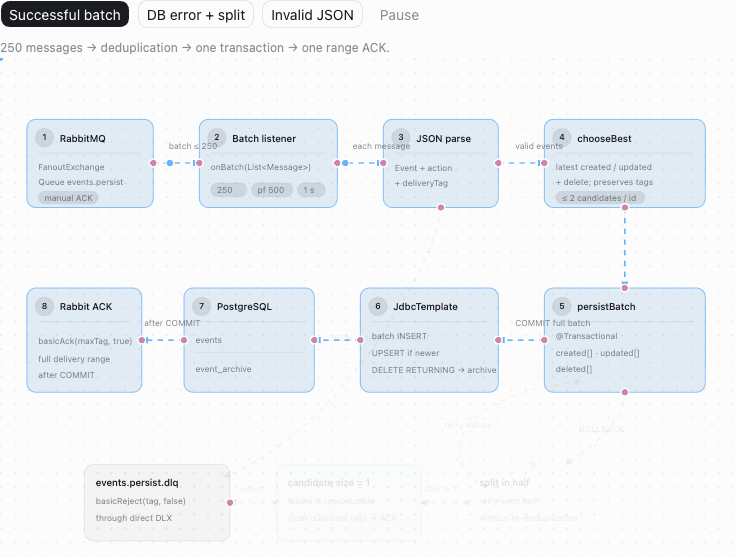

# Animated System Flow for Codex

`visualize-system-flow` is a reusable Codex skill for turning real software architecture and code paths into animated, interactive system-flow diagrams.

It is designed for event pipelines, message queues, batch processing, persistence, transaction boundaries, retries, ACK/reject behavior, DLQs, circuit breakers, and other end-to-end algorithms.

## Example result



The preview switches from a successful batch commit to a database failure with recursive split, per-message ACK, and singleton rejection to a DLQ.

Download and open the [interactive HTML demo](examples/rabbit-to-db-demo.html) to use the scenario buttons, pause or resume message flow, and inspect the responsive mobile layout.

## What it produces

- An interactive diagram directly in the Codex conversation
- Animated message flow across connected components
- Scenario controls for happy paths and failure modes
- Explicit transaction, durability, retry, ACK, reject, and DLQ boundaries
- Responsive desktop and mobile layouts
- A standalone HTML file that preserves animation and controls
- Optional PNG, GIF, or video exports when requested

The skill asks Codex to inspect the actual code, configuration, tests, traces, or recordings before drawing. It should not invent system behavior or configuration values.

## Requirements

- Codex with personal skill support
- The bundled `visualize` skill available in Codex

No credentials, project source code, or generated customer data are included in this repository.

## Install with Codex

Ask Codex:

```text
Install the skill from https://github.com/roship/visualize-system-flow/tree/main/visualize-system-flow
```

Start a new conversation after installation so the skill list refreshes.

## Manual installation

Clone the repository and copy the skill folder into your personal Codex skills directory:

```bash
git clone https://github.com/roship/visualize-system-flow.git
mkdir -p ~/.codex/skills
cp -R visualize-system-flow/visualize-system-flow ~/.codex/skills/
```

Then start a new Codex conversation.

## Usage

Invoke the skill explicitly:

```text
$visualize-system-flow Visualize the order lifecycle from Kafka through validation and payment to PostgreSQL, including retries and DLQ.
```

More examples:

```text
$visualize-system-flow Inspect this codebase and show the complete request path through the API gateway, services, cache, and database, including timeout and circuit-breaker scenarios.
```

```text
$visualize-system-flow Show the batch persistence algorithm from RabbitMQ to PostgreSQL and contrast successful commit with rollback, recursive split, per-message ACK, and DLQ rejection.
```

```text
$visualize-system-flow Use this screen recording as a visual reference and explain the current event-processing topology with animated messages and scenario buttons.
```

## Repository structure

```text
.
├── README.md
├── docs/
│   └── rabbit-to-db-demo.gif
├── examples/
│   └── rabbit-to-db-demo.html
└── visualize-system-flow/
    ├── SKILL.md
    ├── agents/
    │   └── openai.yaml
    └── references/
        └── style-guide.md
```

The installable skill remains intentionally small. Repository documentation stays outside the skill folder so Codex loads only the instructions it needs.

## Updating

Pull the latest repository changes and replace the installed folder:

```bash
git pull
mkdir -p ~/.codex/skills/visualize-system-flow
cp -R visualize-system-flow/. ~/.codex/skills/visualize-system-flow/
```

Open a new Codex conversation after updating.

## Versioning

Releases use semantic version tags such as `v1.0.0`.
